# Aidan LeBlanc (abl77) CSDS 496 Project Writeup

# Related Work

Research on autonomous navigation in partially known or unknown environments spans probabilistic planning, learning-based prediction of environment structure, and vision-based reactive navigation. Three of the most relevant papers to my implementation are discussed in this section. Beginning with a survey paper discussing the partially observable environment framework and then transitioning to more specific learning based approaches.

---

## Planning and Acting in Partially Observable Stochastic Domains (Kaelbling, Littman & Cassandra, 1998)

This foundational work develops the formal theory of POMDPs for planning under uncertainty. The authors show how agents must maintain belief states representing uncertainty about world states and how optimal decisions incorporate both action outcomes and information-gathering. They introduce an exact offline POMDP solution method and describe how finite-memory controllers can be extracted from value functions.

This work provides the theoretical grounding for later approximate navigation systems that cannot compute exact POMDP solutions due to scalability limits.

**Strengths**
- Fully general and mathematically optimal framework.
- Integrates sensing and action uncertainty naturally.
- Provides foundations widely used in later navigation research.

**Limitations**
- Exact solutions are computationally intractable for large maps.
- Requires a complete probabilistic model of the environment.

---

## Learned Subgoal Planning (Stein, Bradley & Roy, 2018)

Stein et al. propose Learned Subgoal Planning, a method for long-horizon navigation in partially revealed environments by predicting properties of unknown space. Their central idea is to convert boundaries between known and unknown regions into dynamic subgoals, which become the high-level action set. The planner evaluates the expected cost of navigating through each subgoal by factorizing the Bellman equation into terms representing:

- Probability of reaching the goal through a subgoal,
- Expected cost when the subgoal leads to a valid path,
- Expected cost when it leads to a dead-end.

These terms are learned from data to approximate otherwise intractable POMDP expectations. Experiments show a 21% reduction in cost-to-go compared to standard optimistic Dijkstra-based planning.

**Strengths**
- Supports long-horizon reasoning.
- Incorporates learned priors about likely dead ends and topology.
- Retains guarantees of classical planners once subgoals are selected.

**Limitations**
- Requires representative training data.
- Depends on structured occupancy-grid maps.
- Uses simplifying assumptions to keep recursion tractable.

---

## Autonomous Navigation in Unknown Environments Using Machine Learning (Richter, 2017 PhD Thesis)

Richter investigates high-speed navigation in unknown environments through supervised learning. The work addresses the conservative nature of traditional planners, which assume unknown space must be treated as hazardous. Instead, three learned models are introduced:

### Collision Probability Prediction
A model predicts the likelihood of collision for trajectories extending beyond the perceptual horizon. This allows the robot to move aggressively while remaining safe and enables speeds up to twice as fast as classical planners.

### Measurement Utility Prediction
Another model predicts the value of future sensor measurements, guiding the robot to locations that maximize visibility and reduce uncertainty.

### Collision Prediction from Raw Images
Deep neural networks predict collision probability directly from monocular camera images, using autoencoder-based novelty detection to generalize across environment types.

**Strengths**
- Enables high-speed minimum-time navigation.
- Combines learning with receding-horizon control.
- Integrates raw visual input for richer predictions.

**Limitations**
- Requires large, diverse training sets.
- Still limited by the inherent short horizon of receding-horizon planning.
- Does not explicitly reason about environment topology.

---

# Cross-Paper Comparison

## Handling of Unknown Space
- **POMDP**: Full probabilistic uncertainty modeling, but intractable.
- **Subgoal Planning**: Learns structural/topological predictions to approximate long-horizon uncertainty.
- **Richter**: Learns collision and visibility predictions for high-speed local decisions.

## Learning vs. Classical Planning
- **Kaelbling**: Pure probabilistic modeling.
- **Stein** and **Richter**: Heavy integration of supervised learning.

## Horizon Length
- **POMDP**: In theory infinite-horizon but impractical.
- **Subgoal Planning**: Long-horizon via predicted topological structure.
- **Richter**: Medium-horizon via receding-horizon + predictions.

## Sensor Modalities
- **POMDP**: Abstract observations.
- **Subgoal Planning**: Occupancy maps.
- **Richter**: Maps + raw images.

---

# Methods

This project investigates how learned models can guide or misguide navigation in grid-based maze environments. The baseline implementation of this project comes from Stein et. al. where long-horizon planning is performed by a learned planner; however, there was no existing codebase for this project, so everything had to be constructed from the ground up. The implementation can be broken up into three sections: (1) establishing a baseline planner, (2) evaluating baseline performance on suboptimal environments, and (3) incorporating maze similarity measures into the path planning algorithm for consistent performance. Sections (2) and (3) are extensions of existing work and (3) presents a nontrivial method for navigating in suboptimal environments.

## 1. Maze Environment Generation

All experiments operate on synthetic, procedurally generated mazes of fixed size (5x5 was used for computational efficiency). The mazes are generated using Kruskal's algorithm, which guarantees that every position in the maze is reachable from every other position. Each maze contains:
- **Open cells**
- **Obstacles**
- **Start position**
- **Goal location**

Three maze types are evaluated in this extension. Base mazes, guided maze, and anti-guided mazes. These mazes differ in the width of paths with base mazes having constant path width, guided mazes having wider paths on the optimal path, and anti-guided mazes having wider paths everywhere except the optimal path. Equivalent examples of the three maze types are shown below (note these are 5x5 mazes because the number of junctions is 5x5):

**Base Maze**

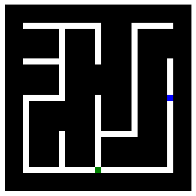

**Guided Maze**

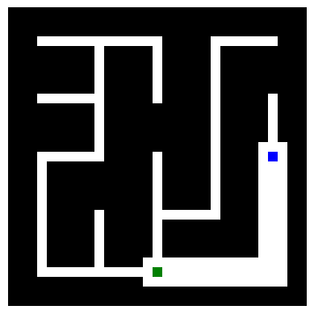

**Anti-Guided Maze**

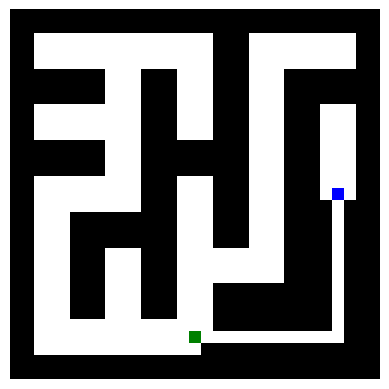

Mazes are generated using the notebook's `generate_mazes()` function, which returns equivalent maze representations for each of the three maze types.

The final element of the maze generation is creating a secondary visible maze mask, which is stored along with the fully visible maze. The maze can then be revealed as the agent explores the world.

## 2. Baseline Path Planning

The baseline performance used by Stein et. al. is an optimistic algorithm that navigates classically using Dijkstra's algorithm. This model optimistically assumes that unobserved space is free of obstacles allowing for the model to select the next best subgoal using heuristics. In this case, I decided to use Manhattan distance as the agent is unable to move diagonally.

The algorithm is implemented in the notebook's `optimistic_plan()` method, which returns the maze with explored areas now visible in addition to the plan path.

The baseline serves as a comparison for later methods to illustrate how the alterations improve performance.

## 3. Learned Subgoal Model

The final element of the paper by Stein et. al. is the learned subgoal planner itself. This approach uses a large dataset of similar environments to train a model to learn structural patterns that can better guide an agent towards the goal in familiar environments. In this context, familiar environments are guided mazes where wider pathways lead towards the goal. The values that are learned for each subgoal are given by 2, 3, and 5 in the equation from the paper by Stein et. al.:

$$
Q(b_t, a_t) =
\underbrace{D(m_t, q_t, q_g)}_{\text{1. Cost to subgoal}}
\;+\;
\underbrace{P_S(b_{t+1} \in G \mid b_t, a_t)}_{\text{2. Succes probability}}
\;
\underbrace{R_S(b_t, q_g, q_G, a_t)}_{\text{3. Success cost}}
$$

$$
\;+\;
\underbrace{\left( 1 - P_S(b_{t+1} \in G \mid b_t, a_t) \right)}_{\text{4. Failure probability}}
\left[
\underbrace{R_E(b_t, q_g, a_t)}_{\text{5. Exploration cost}}
\;+\;
\underbrace{\min_{a \in A(b_t)\setminus a_t} 
Q\big(\{m_t, q_g\}, a\big)}_{\text{6. Expected future cost}}
\right]
$$

In this implementation, I only looked at the future expected cost of one step rather than the whole recursion to reduce the computation time.

### 3.1 Dataset Generation
In order to train the model, there needs to be a large dataset of similar environments. These datasets were generated by optimistically navigating through random mazes and storing key values for observed subgoals along the way. These values are $P_s$, $R_s$, and $R_e$. $P_s$ is the probability of success, which is labeled as 1 or 0 depending on if the corresponding subgoal lies on the optimistic path. $R_s$ and $R_e$ are the cost of success and exploration respectively. The cost of success returns how many steps it takes to get the the goal from a given subgoal, while the cost of exploration returns how many steps it takes to explore the area and return to the given subgoal.

Each maze produces a variable number of samples depending on the optimistic path length, so the method `generate_samples()` was used to continue exploring mazes until the target number of samples is reached.

To provide the model with enough training data, 50000 samples were generated for guided mazes and the inputs and target outputs were saved to `data/5x5_guided_x.pt` and `data/5x5_guided_y.pt` respectively.

Here is an example training input, where the visualization would be flattened and appended with the positon, goal, and subgoal before being saved.

**Example Training Input**

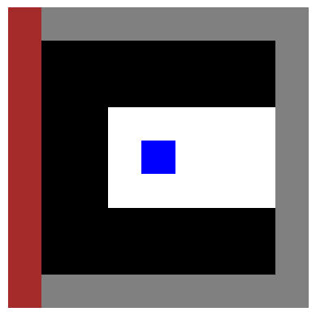

**Positon, goal, subgoal:** [15.  3.  9. 21. 14.  6.]

**($P_s$, $R_s$, $R_e$):** (1, 91, 0)

### 3.2 Model Training
These models were then used to train a fully-connected network. The network architecture is the same as the model used by Stein et. al with hidden layers of width {256, 128, 48, 16}, each followed a batch normalization layer, 50% dropout, and a sigmoid activation function. This allows the model to output one classification value for $P_s$ and two regression values for $R_s$ and $R_e$.

For this implementation, however, the exploration values are not relevant because there is only one path to the solution, so the model only needs to find the subgoal with the highest $P_s$ value. For this reason, and because the regression loss was dominating the model learning, the weight of the regression loss was set to 0.0. Initially, this value was selected to troubleshoot the training; however, this value produced accurate results and fits with this constrained scenario.

Once trained the model was saved as `models/5x5_guided_noreg.pth` for deployment.

### 3.3 Evaluation
The learned subgoal model was then used to find mazes on a variety of randomly generated mazes. The planning performance was measured via path length with the goal of minimizing the path traveled by the agent. In order to minimize the effect of randomness on the trials, the model was evaluated on 100 mazes of each type and compared to the optimistic planner.

## 4. Guided and Anti-Guided Planning

As an extension of the learned subgoal model in section 3, the next step in the procedure is training the same model on alternate datasets to improve performance on difference environment types. The two datasets are a fully anti-guided maze dataset and a hybrid dataset that contains both guided and anti-guided mazes.

### 4.1 Dataset Generation
The anti-guided dataset was generated with the same method as in section 3 except the maze type changes to two for anti-guided mazes.

Again 50000 samples were generated and the inputs and target outputs were saved to `data/5x5_anti_x.pt` and `data/5x5_anti_y.pt` respectively.

The hybrid dataset was generated by taking the first half of both the guided and anti-guided datasets to create a 50000 sample dataset with inputs and outputs saved to `data/5x5_hybrid_x.pt` and `data/5x5_hybrid_y.pt`.

### 4.2 Model Training and Evaluation
The model training was the same as section 3 except using the two new datasets, which resulted in the models, `models/5x5_anti_noreg.pth` and `models/5x5_hybrid_noreg.pth`.

The evaluation methodology was also the same where each model was evaluated on all three maze types and compared to the optimistic planner.

## 5. Environment Similarity Planning
To further address the challenges of conflicting world environments, I implemented a similarity detection model, which directs the model to use the learned subgoal methods in familiar environments, but uses an optimistic planner in unfamiliar ones. This approach is similar to an idea mentioned in Richter's paper where the probability of collision is given by a Bayesian model where the prior is weighted inversely to the number of similar training samples. Thus, in an environment with a limited number of training samples the conservative prior estimate contributes more to the model decision.

The similarity is that the model shifts between model predictions and conservative estimates, but the actual methodology differs with my approach. Because the number of similar samples is not known, it requires a classifier or other approach to determine how similar a current environment is to the training corpus.

### 5.1 Dataset Generation
The dataset for training the cassifier model is generated from traversals through random mazes where the input window is the same as for the planning models and the label is the maze type. In this case, the classifier is paired with the guided maze model, so guided mazes are positively labeled as 1 and all other maze types are labeled as 0.

Then 50000 outputs and inputs were generated and saved to `data/5x5_similarity_x.pt` and `data/5x5_similarity_y.pt`.

### 5.2 Model Training
For this classification model I used a model architecture of with hidden layers of width {128, 48, 16}, each followed a batch normalization layer, 50% dropout, and a sigmoid activation function. The loss was binary cross entropy as this is a classification task. Overall, the network is a smaller version of the `FCN` network for evaluating subgoals.

The model training was the same as with the `FCN` network except using the simplified loss function. The model was then saved to `models/5x5_similarity.pth`.

### 5.3 Incorporation and Evaluation
The similarity model was then incorporated into the planning algorithm in the `adaptable_learned_plan()` method where the similarity evaluation of the current location is passed to the method as a confidence score. Then, for high confidence scores the method is more likely to use the model plan, while for low confidence scores the model is more likely to use the optimistic planner.

With this fully integrated implementation, the model could then be evaluated the same way as the previous models with 100 random mazes of each type and comparing the path cost to that of the optimistic planner.

# Results, Analysis, and Discussion

This section presents the outcomes of all experiments performed in the notebook, including guided model deployment, anti-guided and hybrid models performance, and environment similarity planning. All results reported here can be replicated directly by running the included notebook cells, which generate mazes, train models, compute guided/anti-guided paths, and produce the comparison plots. Further running instructions are included in [README](README.md).

---

## 1. Guided Model Results
### Sample Maze Navigation
**Optimistic Planner**
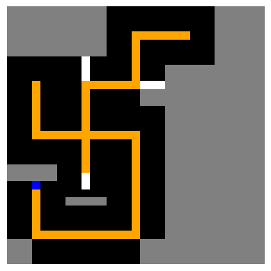

**Guided Model Planner**
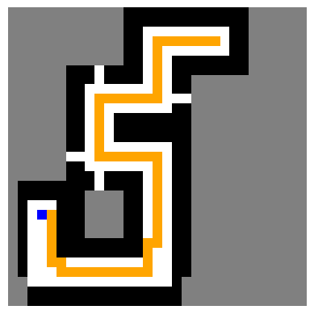

### Average Performance
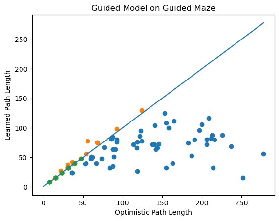

The ratio of total guided model path length to total optimistic path length on guided mazes is 0.672, so the guided model paths are approximately 33% shorter on guided mazes.

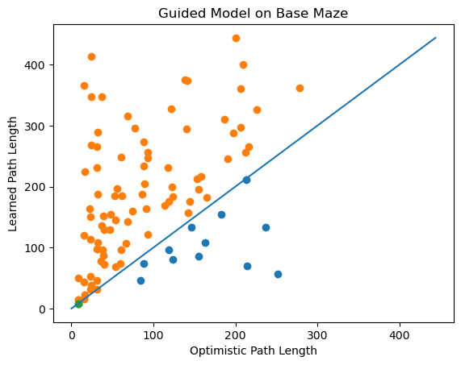

The ratio on base mazes is 2.269, so the guided model paths are more than double the optimistic planner for base mazes.

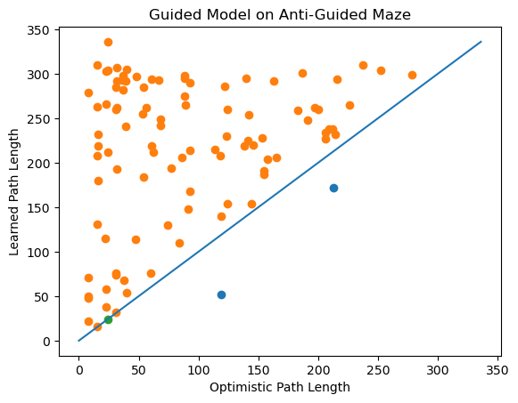

The ratio on anti-guided mazes is 2.77, which indicates that the guided model has an average path length of almost three times more than the optimistic planner on anti-guided models.

## 2. Anti-Guided Model Results
### Sample Maze navigation
**Optimistic Planner**
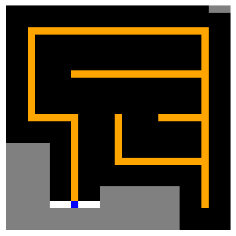

**Anti-Guided Model Planner**
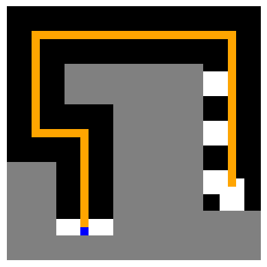

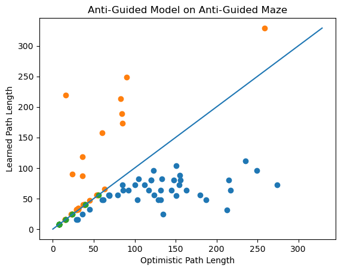
The ratio of total anti-guided model path length to total optimistic path length on anti-guided mazes is 0.564, so the anti-guided model paths are approximately 44% shorter on anti-guided mazes.

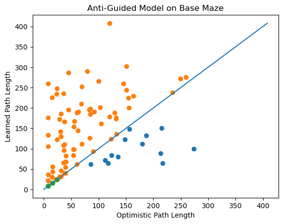
The ratio on base mazes is 1.676, which indicates that the anti-guided model paths are about 67% percent longer for base mazes.

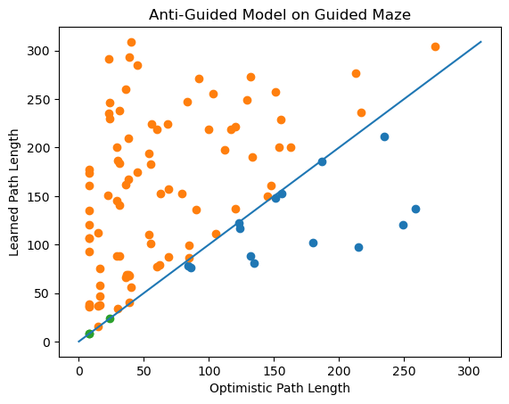
The ratio on guided mazes is 2.05, which is about double the path length compared to the optimistic planner.

## 3. Hybrid Model Results
### Sample Maze Navigation
**Optimistic Planner**
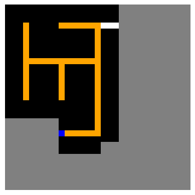

**Hybrid Model Planner on Guided Maze**

**Hybrid Model Planner on Anti-Guided Maze**
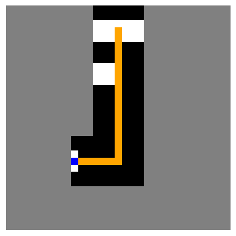

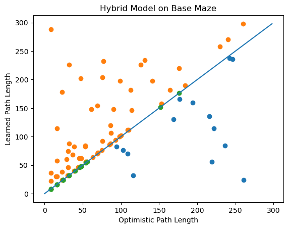
The ratio of total hybrid model path length to total optimistic path length on base mazes is 1.231, so the hybrid path is approximately 77% longer on base mazes.

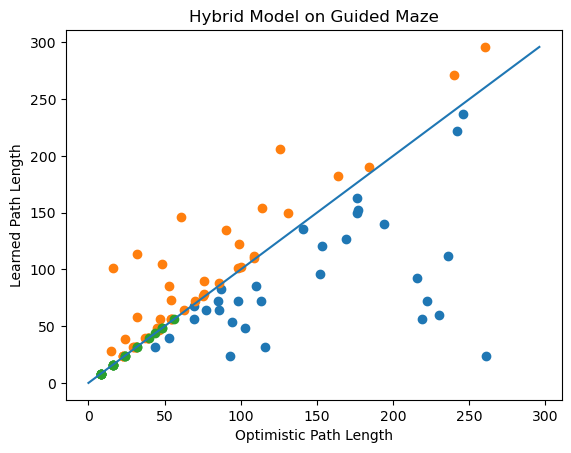
The ratio on guided mazes is 0.888, which indicates that the hybrid model finds 12% shorter paths on guided mazes.

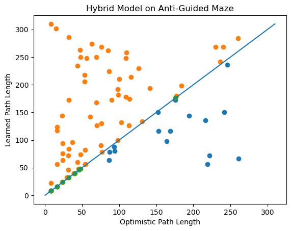
The ratio on anti-guided mazes is 1.581, which is 58% longer than the optimistic planner path.

## 4. Environment Similarity Results
### Sample Maze Navigation
**Optimistic Planner**
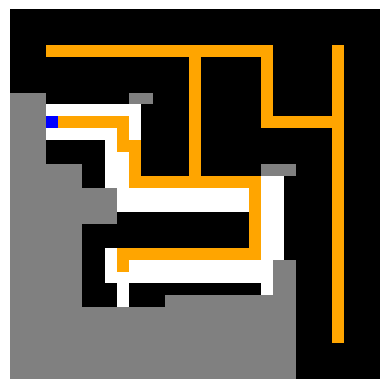

**Guided Planner on Guided Maze**

**Guided Confidence Planner on Guided Maze**
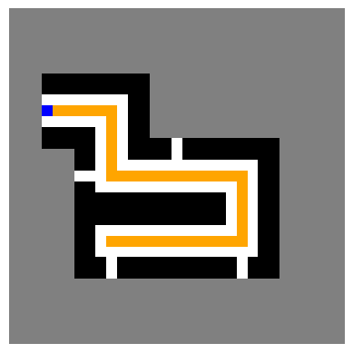

**Guided Planner on Anti-Guided Maze**
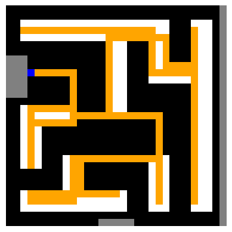

**Guided Confidence Planner on Anti-Guided Maze**
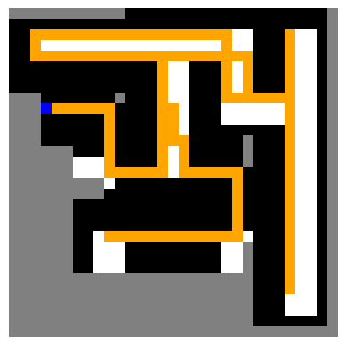

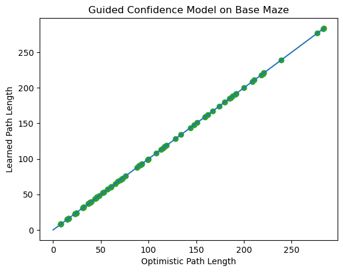
The ratio of total guided confidence planner path length to total optimistic path length on base mazes is 1.0 indicating that the models are returning the same path.

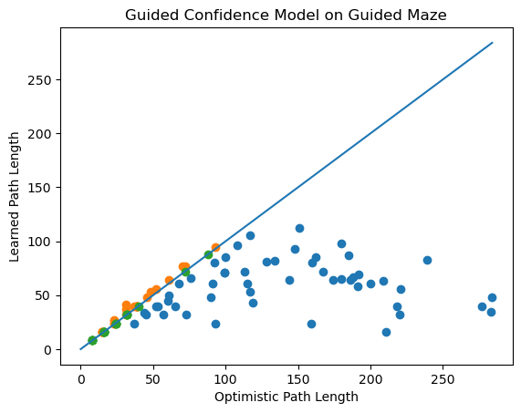
The ratio on guided mazes is 0.537, which is approximately 47% shorter paths for the guided confidence planner on guided mazes.

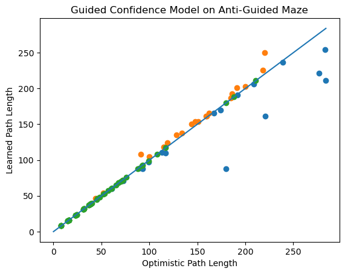
The ratio on anti-guided mazes is 0.976, so the guided confidence planner has approximately equal performance to the optimistic planner on anti-guided mazes.

## 5 Summary Table

| Model Type              | Maze Type      | Ratio (Model / Optimistic)  |
|-------------------------|----------------|-----------------------------|
| **Guided Model**        | Base           | 2.269                       |
|                         | Guided         | 0.672                       |
|                         | Anti-Guided    | 2.770                       |
|                         | **Average**    | **1.904** $\pm$ 0.895       |
| **Anti-Guided Model**   | Base           | 1.676                       |
|                         | Guided         | 2.050                       |
|                         | Anti-Guided    | 0.564                       |
|                         | **Average**    | **1.430** $\pm$ 0.631       |
| **Hybrid Model**        | Base           | 1.231                       |
|                         | Guided         | 0.888                       |
|                         | Anti-Guided    | 1.581                       |
|                         | **Average**    | **1.233** $\pm$ 0.283       |
| **Confidence Model**    | Base           | 1.000                       | 
|                         | Guided         | 0.537                       |
|                         | Anti-Guided    | 0.976                       |
|                         | **Average**    | **0.838** $\pm$ 0.213       |

## 6. Analysis
Model performance varies significantly across model types and maze deployments. The best overall model is the guided confidence model with an average cost ratio of 0.838, which was the only model with average performance better than the optimistic planning model. The best performance on a single maze type was also the guided confidence model with an average cost ratio of 0.537 on guided mazes. The worst performance on a single maze type was the guided model on anti-guided mazes with an average cost ratio of 1.94, which is more than double the guided confidence maze. Therefore, the addition of a confidence score into the guided model was able to significantly improve the performance of the model.

The anti-guided model was hypothesized to have similar performance to the guided model, but instead had consistently lower cost ratios along with a significantly reduced average cost ratio. The hybrid model was hypothesized to have performance similar to the optimistic planner, which is reflected in the low standard deviation and average cost ratio that is relatively close to one. The difference in hybrid model performance between mazes, however, was not anticipated. The hybrid model performs better on guided mazes (0.888), compared to anti-guided mazes (1.581) despite being trained on the same number of both maze types. Additionally, the cost ratio of on the base mazes decreased despite not being trained on any base mazes.

## 7. Discussion
The research extension to incorporate maze similarity scores into the planning process for unfamiliar environments was successful. The incorporation of these confidence scores was able to reduce the maximum cost ratio to one without sacrificing model performance on the guided maze dataset. This result opens the door to a variety of other extensions that could improve performance with more time to explore. One such extension is that the confidence model could be easily shifted to use a different model instead of the optimistic planner model. For example, the similarity classifier could be trained on three maze types and switch between the guided model, anti-guided model, and optimistic planner models. This addition would ideally reduce the confidence model cost ratio on anti-guided mazes. Although not a significant change, this would further improve model performance and provide a framework for deploying learned subgoal planning on larger varieties of environments.

A limitation of this confidence model approach is that the possible environments still need to be known. There could still be scenarios where an agent is deployed in an unfamiliar environment type that the agent has never seen before. In this scenario, it is difficult for a learned classifier to correctly identify an environment as familiar or not. A potential solution to this is to calculate the average environment in the training dataset. Then any environment can be compared to this average and if it within a small epsilon of that value it is thought of as familiar. This removes the need for a learning model and so will generalize better to completely novel environments.

---

# Bibliography

## Research Papers

**Richter, C. A. (2017).**  
*Autonomous Navigation in Unknown Environments Using Machine Learning.*  
PhD Thesis, Massachusetts Institute of Technology.

**Stein, G. J., Bradley, C., & Roy, N. (2018).**  
*Learning over Subgoals for Efficient Navigation of Structured, Unknown Environments.*  
2nd Conference on Robot Learning (CoRL 2018).  

**Kaelbling, L. P., Littman, M. L., & Cassandra, A. R. (1998).**  
*Planning and Acting in Partially Observable Stochastic Domains.*  
Artificial Intelligence, 101(1).

---

## Pre-existing Code and Libraries Used

**PyTorch (Paszke et al.)**  
Used for implementing and training FCN models (Maze-X and Similarity-X).

**NumPy**  
Used for maze generation, numerical utilities, and data manipulation.

**Matplotlib**  
Used for visualization and generating comparison plots.

**Visual Studio Code**  
Used as the environment for experiment execution and reproducibility.

---

## AI Tools Used

**OpenAI ChatGPT (GPT-5.1)**  
Used for:
- Project report outline generation
- First draft of the related work and bilbliography sections in the report.
- Converting equations to markdown
- First draft of the README.md file
- Generated PyTorch model creation and training code
- Various debugging queries

---

